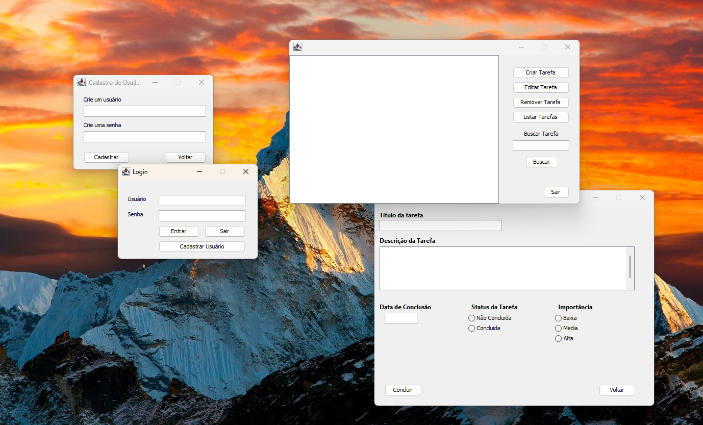

<h1 align="center">Sistema de gerenciamento de tarefas</h1>

Sistema de tarefas

  <a href="#-tecnologias">Tecnologias</a>&nbsp;&nbsp;&nbsp;|&nbsp;&nbsp;&nbsp;
  <a href="#-projetos">Projeto</a>&nbsp;&nbsp;&nbsp;|&nbsp;&nbsp;&nbsp;
  <a href="#memo-licença">Licença</a>

  

 

## 🚀 Tecnologias 

- Java e Swing
- Git e Github 

## 💻 Projeto

O objetivo era desenvolver um sistema de gerenciamento de tarefas para a disciplina de Programação Orientada a Objetos, do curso de Análise e Desenvolvimento de Sistemas do IFPB.

## :memo: Licença

Esse projeto está sob a licença MIT.
 
